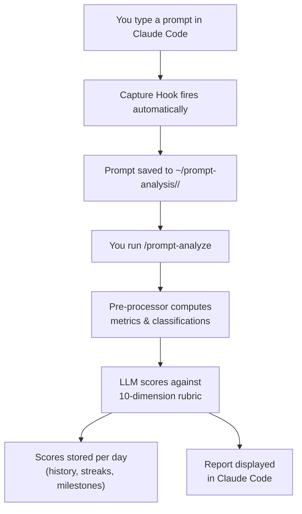

<h1 align="center">Claude Prompt Analyzer</h1>

<p align="center">
  
</p>

<p align="center">
  <strong>A Claude Code tool that makes you measurably better at prompting — automatically.</strong>
</p>

<p align="center">
  
  
  
</p>

> **Note:** This is the frozen v1.1 release branch. The latest version is [v2.0.0](https://github.com/sahaarijit/claude-prompt-analyzer).

---

<p align="center">
  
</p>

## Features

**1. Every prompt you write is automatically tracked**
Every prompt you type in Claude Code is silently logged, organized by project and day.
> Data lives in `~/prompt-analysis/` — centralized, outside your project repos.

**2. Deep quality feedback across 10 dimensions**
Clarity, specificity, context-giving, actionability, scope control, command usage, pattern efficiency, interaction style, friction avoidance, automation awareness.
> *"Specificity: 3.2/10 — `fix the bug` gives Claude nothing to go on."*

**3. Scores that compound over time**
Each analysis tracks cumulative scores, streaks, and milestones. You see exactly which dimensions moved.
> *"5-day streak — composite up 0.8 points from last Monday."*

**4. Self-improving classification**
The system learns your prompt habits from LLM feedback and improves classification accuracy over time.

**5. Your data survives repo changes**
Prompts are stored in `~/prompt-analysis/` — not inside project directories. Deleting or moving a repo never affects your prompt history.

**6. One-command setup**
A deploy script installs everything into `~/.claude/` in one step.

---

<p align="center">
  
</p>

## Installation

**Prerequisites:** Node.js >= 16, Claude Code

Clone the repository and run the deploy script:

```bash
git clone https://github.com/sahaarijit/claude-prompt-analyzer.git
cd claude-prompt-analyzer
git checkout v1.1
node scripts/deploy.js
```

Then restart Claude Code.

### Upgrade from v1.0

```bash
git pull
node scripts/deploy.js
```

The deploy script detects your current version and shows the version change (`1.0.0 → 1.1.0`).

### Uninstall

Delete the installed files from `~/.claude/`:
```bash
rm ~/.claude/hooks/capture-prompts.js
rm -rf ~/.claude/skills/prompt-analyze/
```
And remove the hook entry from `~/.claude/settings.json` manually.

---

<p align="center">
  
</p>

## How to Use

| Command | What it does |
|---|---|
| `/prompt-analyze` | Analyze today's prompts across all projects; shows scored report |

---

<p align="center">
  
</p>

## How It Works



---

<p align="center">
  
</p>

## Credits

- Jumping Claude mascot from [shanraisshan/claude-code-best-practice](https://github.com/shanraisshan/claude-code-best-practice)
- Built with zero npm dependencies. Pure Node.js standard library.
